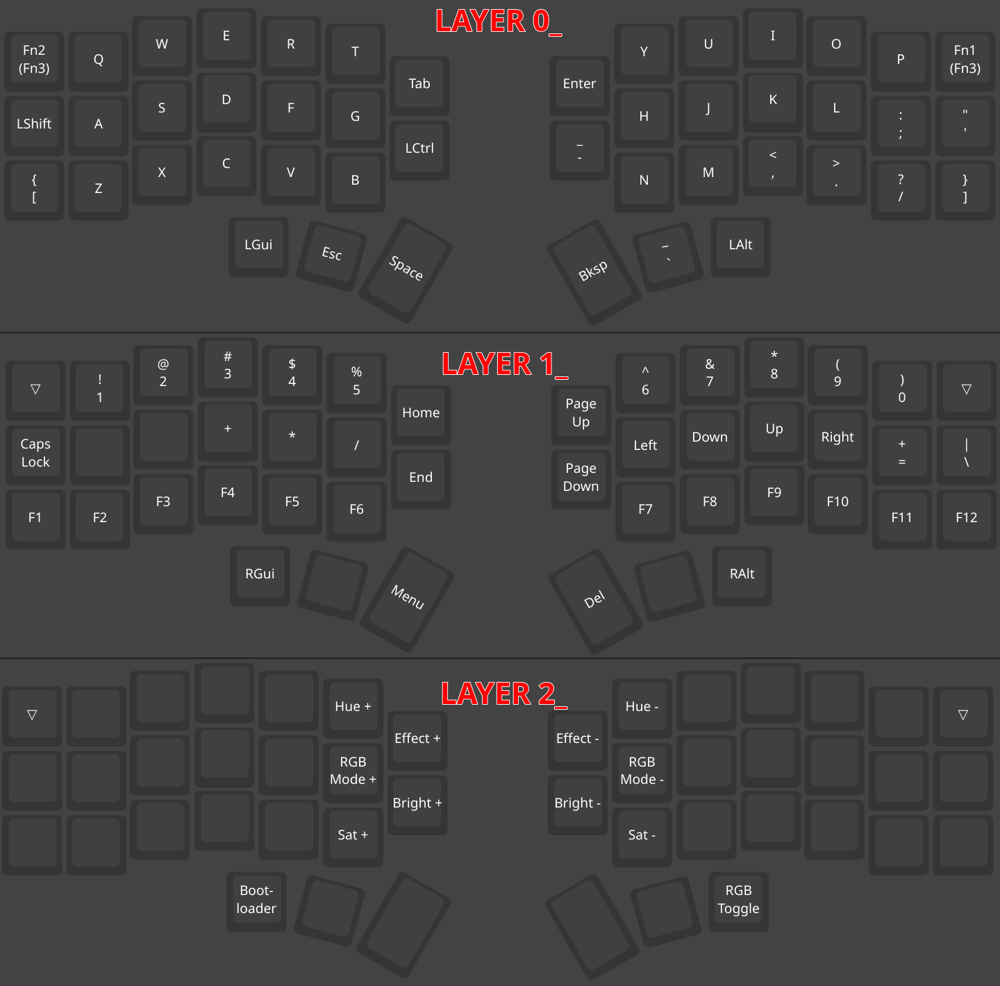

# Setup / customize the Corne V4 Mechanical split keyboard on EndeavourOS

## 1) Install the vial app

yay -S vial-appimage --noconfirm

## 2) Create udev rule to detect the keyboard

A) Get the keyboard id:

```bash

lsusb  # it will show as "corne v4 ...."

```

B) Create an udev rule with the following contents:

```bash

sudoedit /etc/udev/rules.d/59-vial.rules  # Below is the content of the file

# Foostan Corne v4 with Vial
KERNEL=="hidraw*", SUBSYSTEM=="hidraw", \
  ATTRS{serial}=="*vial:f64c2b3c*", \
  ATTRS{idVendor}=="4653", ATTRS{idProduct}=="0004", \
  MODE="0660", GROUP="users", TAG+="uaccess", TAG+="udev-acl"

```

C) Then, reload udev:

```bash

sudo udevadm control --reload

sudo udevadm trigger

```

## 3) Open the "vial" app on your applications menu.

D) Create a new custom layout or load my custom layout that was saved [here](./saved-layouts/initial.20251218-194809.vil)

## EXTRAS

- I have printed a screenshot of each of the layers I configured (0, 1 & 2), and then I used Imagemagick to stack them one below the other (0, 1 then 2):

```bash

magick convert split-keyboard-corne-v4-layer-0.png split-keyboard-corne-v4-layer-1.png split-keyboard-corne-v4-layer-2.png -append split-keyboard-corne-v4-layers.png

```



- Here is a conversation I had with Perplexity AI to understand the Vial app better: <https://www.perplexity.ai/search/how-do-i-create-an-udev-rule-t-gHl1tK9bSTaZ6YNlCQQPPw>
